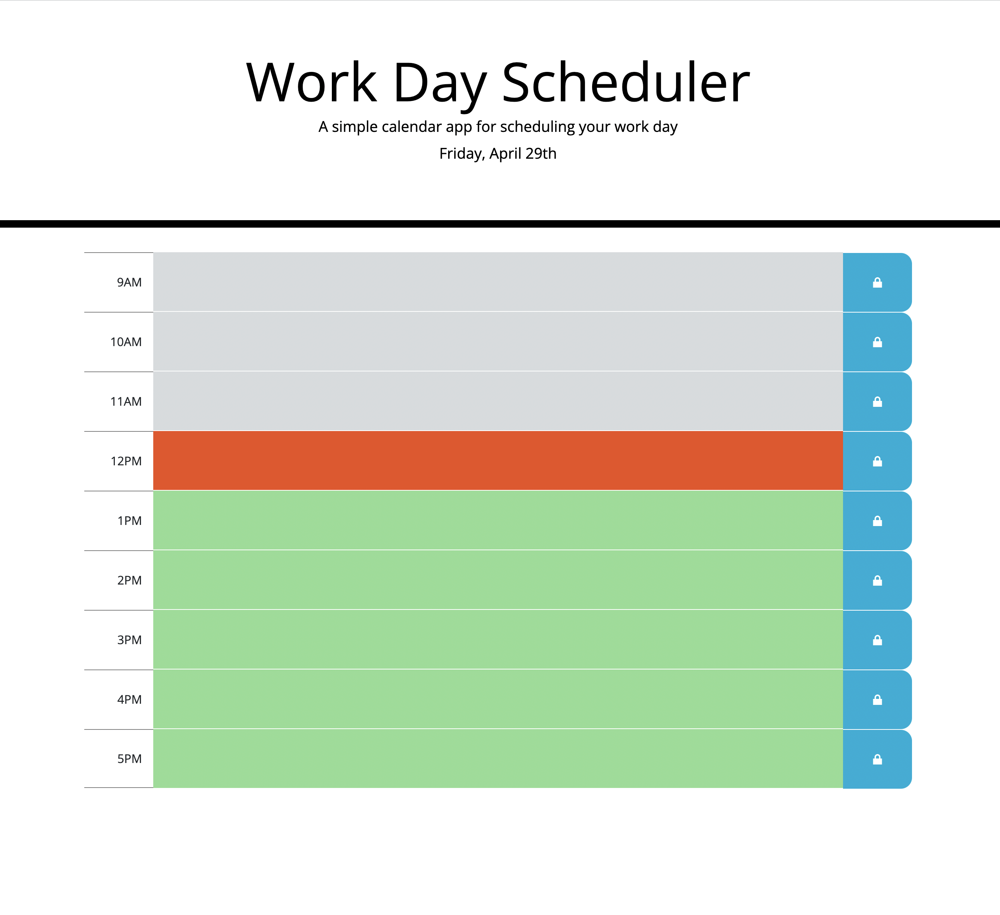
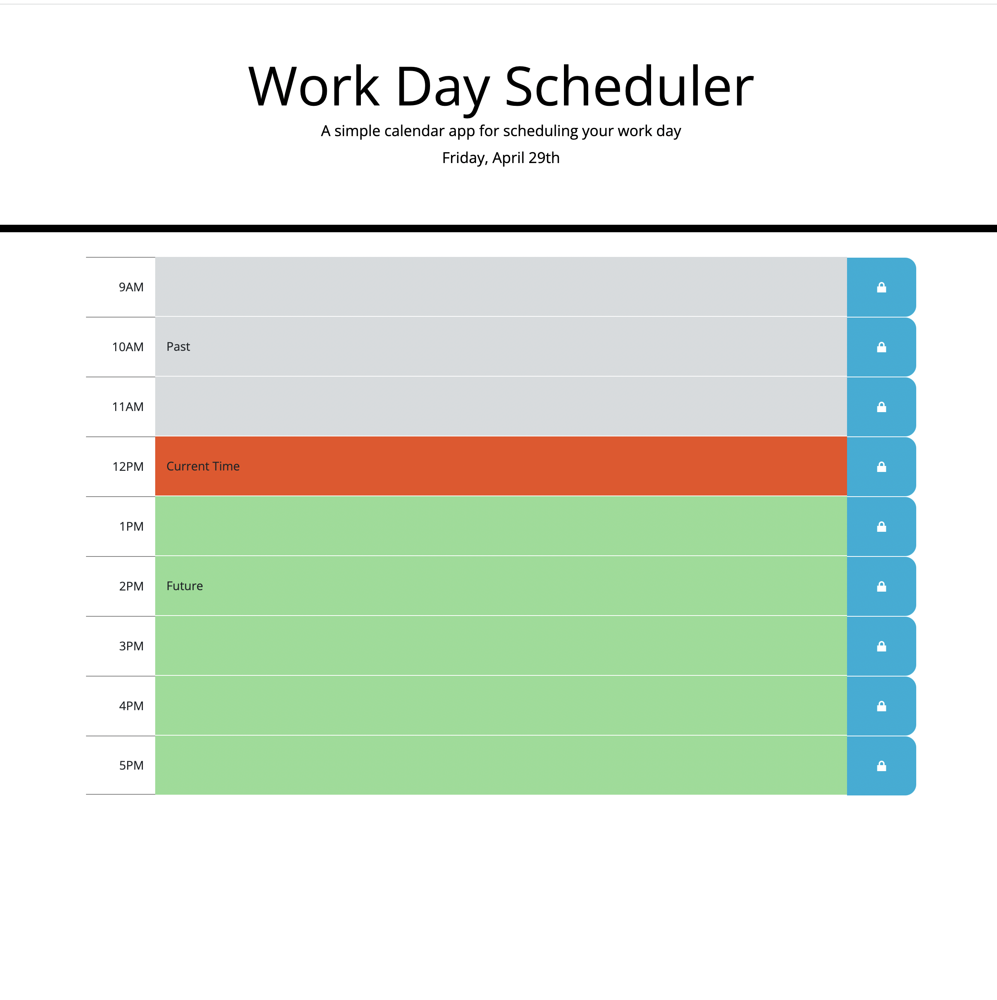

# Work Day Scheduler 

 ## Description

 This application allows the user to create a daily schedule.  This application uses jQuery, Bootstrap, and Luxon for time and date functionality.  This application also stores the user's scheduled items in local storage for data persistence. 

## Table of Contents

  - [Usage](#usage)
  - [Appearance](#appearance)
  - [Contributing](#contributing)
  - [Questions](#questions)

  ## Usage

  This application has been deployed.  To use this application, simply click on the following link: <a href="https://greenmanaustin.github.io/work-day-scheduler/">Deployed Application</a>

  ## Appearance

 

 

  ## Contributing

  All comments and suggestions will be carefully considered and will be greatly appreciated.

  ## Questions

  My Github page is: https://github.com/greenmanaustin

  You can reach me with questions at: sheroo.bhagia@gmail.com